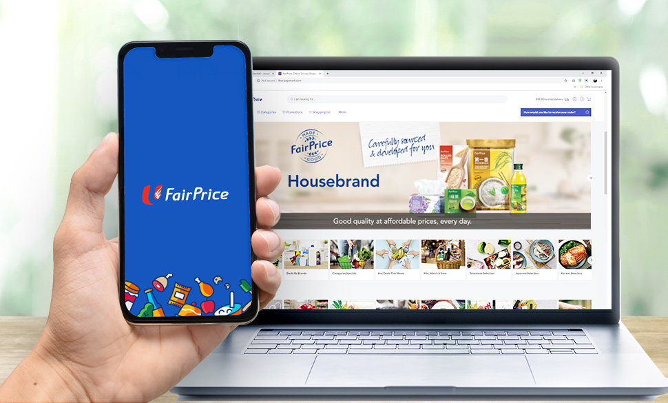
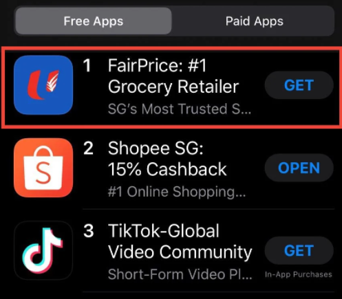

### DSI Capstone Project:
# Sentiment Analysis on NTUC Fairprice Mobile App
---
*Esther Leung Sau Yee (GA DSI 16)*

# Problem Statement

### "How Might We Improve NTUC Fairprice Mobile App User Experience to Boost Online Grocery Sales?"

**NTUC Fairprice** is Singapore's homegrown supermarket chain, and is named the [**top Singapore local brand**](https://www.campaignasia.com/article/singapores-top-local-brands-ntuc-fairprice-and-dbs-champion-nationalistic-spiri/463305) in Campaign Asia's Top 1000 Brands in 2020.

In **first half of 2020**, with the spread of **Covid-19** and the implementation of **circuit breaker and social distancing measures** in Singapore, [**supermarket sales was brisk**](https://www.dbs.com.sg/sme/aics/templatedata/article/generic/data/en/GR/042020/200406_insights_singapore_consumer.xml) according to DBS Group Research. **Online grocery sales** has grown tremendously over the past decade, and DBS estimated the size of online grocery market at S$600 million in January 2020 before Covid-19. 

With Covid-19, the **proportion of online sales in the Supermarket category** has increased according to Singstats, from **7.5%** in [March 2020](https://www.singstat.gov.sg/-/media/files/news/mrsmar2020.pdf) to **11.7%** in [August 2020](https://www.singstat.gov.sg/-/media/files/news/mrsaug2020.pdf). NTUC Fairprice capitalized on the growth in online grocery market by [launching its e-commerce mobile applications in the year 2015](https://www.todayonline.com/shop-go-ntuc-fairprice) as part of its digital strategy. With panick buying and the sudden surge in demand at the start of Covid-19, [the NTUC Fairprice app topped as the number one app on Apple AppStore](https://mustsharenews.com/ntuc-fairprice-app-store/) on 8 Feb 2020 following capacity issues with the NTUC online shopping website.

Even with subsequent [increase in online capacity](https://www.channelnewsasia.com/news/singapore/ntuc-fairprice-online-service-delivery-fee-covid-19-12647142), it is clear that NTUC Fairprice needs to **ride the growth the online grocery market** by **identifying negative reviews or sentiments** on the NTUC Fairprice mobile app for **prompt follow up action**, and **improve overall mobile app customer experience** by identifying customers' **pain points**, and the **values sought** from the mobile app usage.

As such, in this project, I aim to:

1. Build a **classification model** for positive vs. negative reviews
2. Apply **topic modelling** to identify consumers' pain points from negative reviews

---

# Executive Summary

### 1. Text classification to identify negative reviews for prompt follow up
Based on evaluation of the variou classification models built, the production model is a **Voting Classifier** consisting of an ensemble of a **Multinomial NB model and Logistic Regression model**, with features extracted using the **TfidfVectorizer**. 

Given its **relatively high accuracy (0.88) and recall (0.89) on the test data**, we can conclude that the model generalises well on unseen data, and can be used to **identify negative reviews** for NTUC Fairprice mobile app, which can **allow for prompt follow up and service recovery**.

### 2. Topic modelling to identify customer pain points for improvement opportunities
Based the **topic modelling using LDA**, the 3 main customer pain points identified are:

1. **Bugs/ Laggy interface**
2. **Out-of-stock/ No delivery slot**
3. **Payment/ Credit card issues**

Based on these pain points on the user journey, it can be seen that **poor customer experience leans towards the later part of the user journey**, leading to **abandon carts** and **loss of revenue**.

#### User Journey Mapping

The NTUC Fairprice mobile app team can look into ways to improve customer experience, by prioritising 2 aspects:

1. App development team - To focus on ensuring that app is not laggy in times of high loads, and rectify issues such as items disappearing from carts and payment errors.
2. Operations & supply chain team - To focus on inventory management, and improve delivery capacity, either through expanding delivery team or engaging third party logistics support.

---

# Project Approach

### 1. Data Collection 

The NTUC Fairprice mobile app reviews were scraped from Google Play Store and Apple Appstore.

At the end of the data collection and merging from the 2 platforms, the dataset contains the following features:

| Features | Description |
|:--- | :--- |
| date | Date and time of review |
| review | User review on the mobile app |
| rating | User rating on the mobile app (1 to 5, with 5 is highest and 1 is lowest) |
| user | Username |
| source | Source of review (Google Play Store or Apple AppStore) | 

#### 2. Pre-processing & Feature Engineering

Data cleaning was done to remove records with missing text reviews.

Pre-processing was then done on the text reviews:
* Remove HTML tags using BeautifulSoup
* Remove non-letter characters
* Convert words to lower case
* Remove stop words
* Lemmatize the words to its root word form using NLTK Lemmatizer

Following pre-processing, reviews with no meaningful words were dropped.

In addition, the VADER Sentiment Analyzer was applied to create additional features based on the sentiment of the reviews:
* Negative score
* Neutral score
* Positive score
* Compound score (computed by normalizing the scores above)

Positive score was selected as feature for modelling in addition to the text review itself.

#### 3. Text Classification 

Text classification models were built to classify negative reviews vs. positive reviews based on the text reviews scraped. The models' performance summarized in the following table:

| Model | Train Accuracy | Test Accuracy | Recall | ROC AUC Score |
|:--- |:---:|:---:|:---:|:---:|:---:|:---:|
| Voting Classifier (Logistic Regression & Multinomial NB with TfidfVectorizer)| 0.92 | 0.88 | 0.89 | 0.94| 
| MultinomialNB with TfidfVectorizer (with Vader Positive Score as features) | 0.91 | 0.88 | 0.88 | 0.94 |
| LSTM Model | 0.90 | 0.88 | 0.85 | 0.94 |
| MultinomialNB with TfidfVectorizer | 0.85 | 0.87 | 0.89 | 0.94 |
| Logistic Regression with TfidfVectorizer | 0.85 | 0.87 | 0.89 | 0.93 |
| MultinomialNB with CountVectorizer | 0.84 | 0.87 | 0.86 | 0.93 |
| Support Vector Machine with TfidfVectorizer | 0.85 | 0.86 | 0.89 | 0.92 |
| Logistic Regression with CountVectorizer | 0.84 | 0.85 | 0.83 | 0.92 |
| Support Vector Machine with CountVectorizer | 0.83 | 0.84 | 0.85 | 0.93 |

Baseline Accuracy: 0.51

Based on evaluation of the variou classification models built, the production model is a **Voting Classifier** consisting of an ensemble of a **Multinomial NB model and Logistic Regression model**, with features extracted using the **TfidfVectorizer**. 

Given its **relatively high accuracy (0.88) and recall (0.89) on the test data**, we can conclude that the model generalises well on unseen data, and can be used to **identify negative reviews** for NTUC Fairprice mobile app, which can **allow for prompt follow up and service recovery**.

#### 4. Topic Modelling

Latent Dirichlet Allocation (LDA) model was built for topic modelling of the negatives reviews, to help pinpoint the customers' pain points.

Based on the model, 3 key customer painpoints emerged:

1. **Bugs/ Laggy interface**
2. **Out-of-stock/ No delivery slot**
3. **Payment/ Credit card issues**

To address these customer pain points, NTUC Fairprice can consider to prioritize the following aspects for continuous customer experience improvement:
1. App development team - To focus on ensuring that app is not laggy in times of high loads, and rectify issues such as items disappearing from carts and payment errors.
2. Operations & supply chain team - To focus on inventory management, and improve delivery capacity, either through expanding delivery team or engaging third party logistics support.